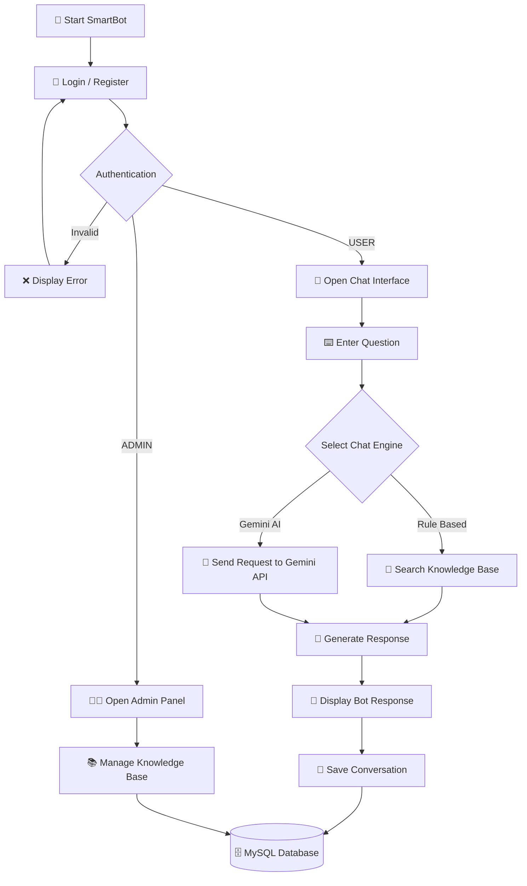
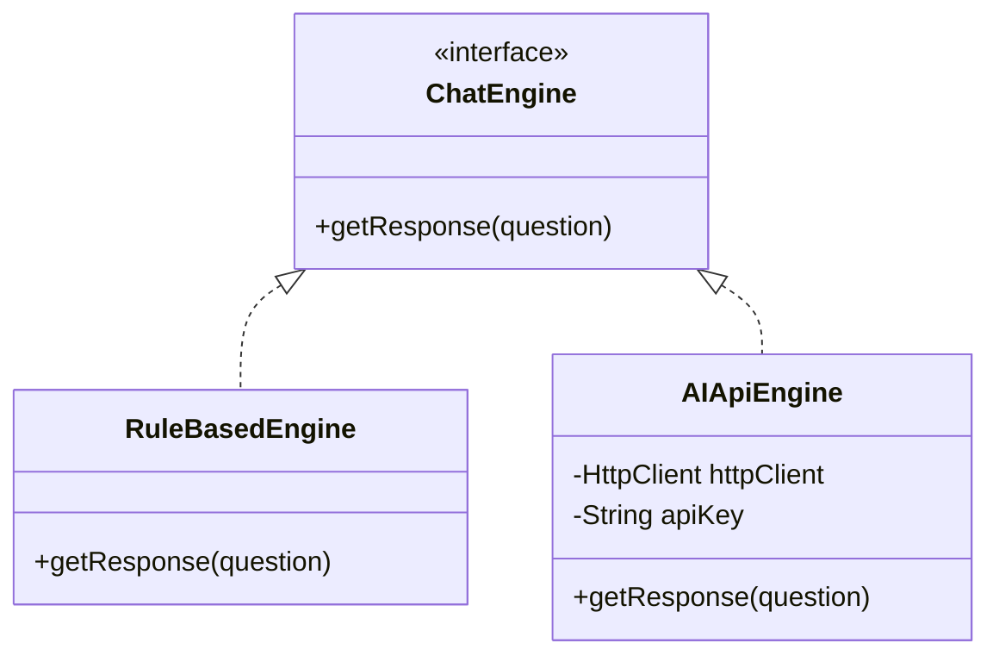
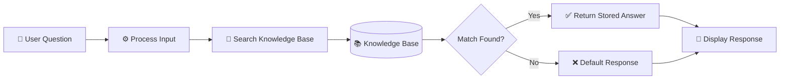
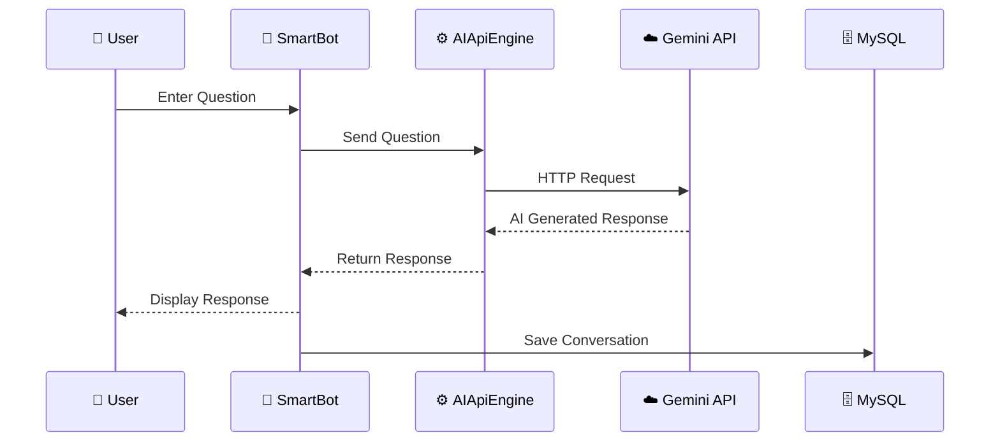
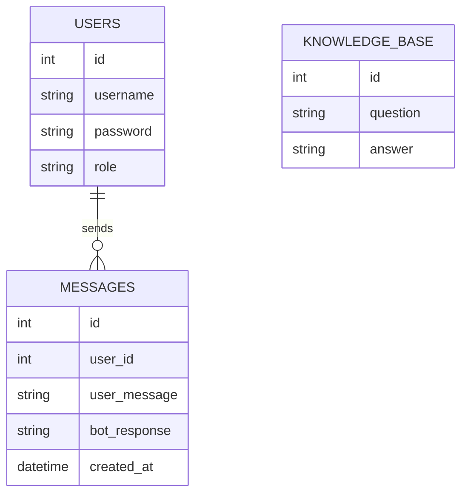
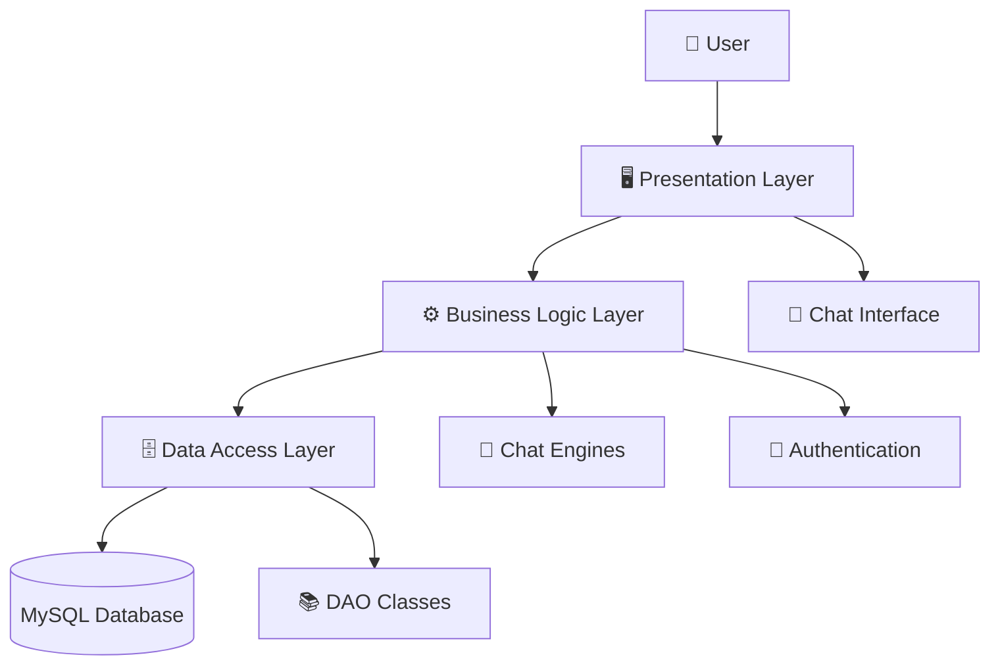

<div align="center">

# 🤖 SmartBot – AI Chatbot Application

### Java 17 • Swing • MySQL • JDBC • Gemini AI

A desktop-based AI chatbot application built using Java 17 with
multiple chatbot engines, database integration, user authentication,
chat history and an admin knowledge-base management system.

</div>

---

# 📌 Project Overview

**SmartBot** is a desktop-based AI chatbot application developed using
**Java 17** and **Java Swing**.

The application provides an interactive graphical user interface where
users can communicate with the chatbot using different response engines.

SmartBot combines a **local Rule-Based Chatbot** with an
**AI-powered Gemini API Engine**.

The application also provides:

- 👤 User Registration
- 🔐 User Login
- 👥 Role-Based Access
- 💬 Chat Interface
- 🕒 Chat History
- 🧠 Rule-Based Chat Engine
- 🤖 Gemini AI Chat Engine
- 🗄️ MySQL Database Integration
- 🔌 JDBC Connectivity
- 👨‍💼 Admin Panel
- 📚 Knowledge Base Management
- ⚠️ Custom Exception Handling
- 🌐 HTTP API Integration

  ---

# 🎯 Problem Statement

Traditional rule-based chatbots can only respond to questions that
have already been defined in their knowledge base.

AI-based chatbots, on the other hand, can generate dynamic responses
using external AI services.

The objective of SmartBot is to combine both approaches into a single
desktop application.

Users can select between:

```text
Rule Based (Local)
        OR
AI (Gemini)

```
---

# 🎯 Objectives

The main objectives of SmartBot are:

1. Develop a desktop chatbot application using Java.
2. Create an interactive GUI using Java Swing.
3. Implement user registration and authentication.
4. Implement role-based access for users and administrators.
5. Store users and conversations in MySQL.
6. Implement a Rule-Based chatbot engine.
7. Integrate Google's Gemini API.
8. Provide an Admin Panel.
9. Allow administrators to manage the chatbot knowledge base.
10. Demonstrate Java OOP concepts.
11. Implement custom exception handling.
12. Demonstrate JDBC database connectivity.
13. Demonstrate HTTP API communication using Java 17.

                    SMARTBOT
                       │
                       ▼
                ┌──────────────┐
                │     USER     │
                └──────┬───────┘
                       │
                       ▼
              ┌──────────────────┐
              │ Register / Login │
              └────────┬─────────┘
                       │
                       ▼
              ┌──────────────────┐
              │  Chat Interface  │
              └────────┬─────────┘
                       │
                       ▼
              ┌──────────────────┐
              │  Select Engine   │
              └───────┬───┬──────┘
                      /     \
                     /       \
                    ▼         ▼
          ┌──────────────┐  ┌──────────────┐
          │ Rule-Based   │  │  Gemini AI   │
          │    Engine    │  │    Engine    │
          └──────┬───────┘  └──────┬───────┘
                 │                 │
                 ▼                 ▼
        ┌───────────────┐  ┌───────────────┐
        │ Knowledge     │  │  Gemini API   │
        │    Base       │  │               │
        └───────┬───────┘  └───────┬───────┘
                 │                 │
                 └────────┬────────┘
                          ▼
                  ┌──────────────┐
                  │ Bot Response │
                  └──────┬───────┘
                         │
                         ▼
                  ┌──────────────┐
                  │    MySQL     │
                  │   Database   │
                  └──────────────┘

---

# 🔄 Application Workflow

The following workflow explains how SmartBot processes a user request
from login to chatbot response and database storage.


---

# 🤖 Chat Engine Architecture

SmartBot uses a common `ChatEngine` interface to support different
chatbot response engines.

The application currently provides two main implementations:

- 🧠 Rule-Based Engine
- 🤖 Gemini AI Engine

Both engines implement the same `ChatEngine` interface.


---

# 🧠 Rule-Based Engine

The Rule-Based Engine is a local chatbot engine that processes the
user's question and searches the available knowledge base for a
matching question or keyword.

It does not require an external AI API.

## 🔄 Rule-Based Processing Flow


---

# 🤖 Gemini AI Engine

The Gemini AI Engine allows SmartBot to generate dynamic responses
using Google's Gemini AI API.

Unlike the Rule-Based Engine, it does not depend only on predefined
questions stored in the knowledge base.

## 🔄 Gemini AI Processing Flow


---

# 🗄️ Database Architecture

SmartBot uses **MySQL** as its database system.

The database is used to store user accounts, chat conversations and
the knowledge base used by the Rule-Based Engine.

## 🧩 Database Components


---

# 🏛️ Three-Tier Architecture

SmartBot follows a layered architecture that separates the user
interface, application logic and database operations.

This makes the application easier to understand, maintain and extend.

## 📐 Architecture Diagram


## 1️⃣ Presentation Layer

The Presentation Layer is responsible for the application's graphical
user interface.

---

# 📁 Project Structure

The SmartBot project is organized into separate packages based on their
responsibilities.

```text
SmartBot/
│
├── src/
│   ├── model/
│   │   ├── User.java
│   │   └── Message.java
│   │
│   ├── engine/
│   │   ├── ChatEngine.java
│   │   ├── RuleBasedEngine.java
│   │   └── AIApiEngine.java
│   │
│   ├── dao/
│   │   ├── UserDAO.java
│   │   ├── MessageDAO.java
│   │   └── KnowledgeBaseDAO.java
│   │
│   ├── db/
│   │   └── DBConnection.java
│   │
│   ├── exception/
│   │   ├── BotException.java
│   │   └── InvalidInputException.java
│   │
│   ├── gui/
│   │   ├── LoginFrame.java
│   │   ├── RegisterFrame.java
│   │   ├── ChatFrame.java
│   │   └── AdminFrame.java
│   │
│   └── utils/
│       ├── EnvLoader.java
│       ├── ChatLogger.java
│       └── TypingThread.java
│
├── database/
│   └── smartbot.sql
│
├── lib/
│   └── mysql-connector-j.jar
│
├── .env.example
├── .gitignore
├── README.md
└── chat_log.txt

```
---

# 🛠️ Technology Stack

SmartBot is developed using Java-based technologies along with MySQL
and the Gemini API.

| Technology | Purpose |
|---|---|
| ☕ Java 17 | Core application development |
| 🖥️ Java Swing | Graphical User Interface |
| 🗄️ MySQL | Database management |
| 🔌 JDBC | Java–MySQL connectivity |
| 🤖 Gemini API | AI-generated chatbot responses |
| 🌐 Java HttpClient | HTTP communication with Gemini API |
| 🧩 OOP | Application architecture and code organization |
| 🔐 Environment Variables | Secure API key configuration |
| 📦 Git & GitHub | Version control and project hosting |
| 💻 VS Code | Development environment |

## 🔧 Core Technologies

### ☕ Java 17

Java is used as the primary programming language for developing the
SmartBot application.

### 🖥️ Java Swing

Swing is used to create the desktop graphical user interface, including
login, registration, chat and admin interfaces.

### 🗄️ MySQL

MySQL stores application data such as users, conversations and
knowledge-base information.

### 🔌 JDBC

JDBC provides communication between the Java application and MySQL
database.

### 🤖 Gemini API

The Gemini API is used by the AI chatbot engine to generate dynamic
responses.

### 🌐 Java HttpClient

Java's built-in `HttpClient` is used to send HTTP requests to the
Gemini API.

### 📦 Git & GitHub

Git is used for version control and GitHub is used to host and manage
the project source code.

---

# 🧠 OOP Concepts Used in SmartBot

SmartBot demonstrates important Object-Oriented Programming concepts
throughout the application.

## 1️⃣ Encapsulation

Encapsulation is used to keep class data private and provide controlled
access through methods.

Example:

```java
private String username;
private String role;

public String getUsername() {
    return username;
}

public String getRole() {
    return role;
}

```
---

# 🛡️ Exception Handling

SmartBot uses custom exception classes to handle application-specific
errors in a structured way.

## 🔹 Custom Exceptions

The project includes custom exceptions such as:

```text
BotException
InvalidInputException

```
---

# ⚙️ Environment Configuration

SmartBot uses an environment variable to store the Gemini API key.

The API key should **not** be written directly inside the source code.

## 🔐 `.env` File

Create a `.env` file in the root directory of the project:

```env
GEMINI_API_KEY=YOUR_GEMINI_API_KEY

```
---

# 💬 Example Interaction

A typical SmartBot interaction can look like this:

### 👤 User

```text
What is Java?

```
### 🤖 SmartBot

```text
Java is a high-level, object-oriented programming language.

```
# 🚀 Future Enhancements

SmartBot can be further improved with additional features in future
versions.

- 🎙️ Voice-based chatbot interaction
- 🌐 Multi-language chatbot support
- 💬 Improved conversation context and memory
- 🧠 Advanced AI-powered knowledge retrieval
- 📱 Mobile application version
- ☁️ Cloud database integration
- 📊 Admin analytics and conversation statistics
- 🔐 Enhanced authentication and security
- 📚 Larger and more advanced knowledge base
- 🔌 Support for additional AI providers

---

# 🎓 Learning Outcomes

Developing SmartBot provides practical experience with several important
software development concepts.

Through this project, the following concepts are demonstrated:

- ☕ Java 17 application development
- 🖥️ Java Swing GUI development
- 🧠 Object-Oriented Programming
- 🔌 JDBC database connectivity
- 🗄️ MySQL database management
- 🌐 HTTP API communication
- 🤖 AI API integration
- 🔐 Authentication and role-based access
- 🧩 Interface-based programming
- 🔄 Polymorphism
- 🛡️ Custom exception handling
- 📦 DAO-based database architecture
- 🔧 Environment variable configuration
- 📁 Modular project organization
- 🌿 Git and GitHub version control

---

# 📚 Project Concepts Demonstrated

SmartBot combines multiple software engineering concepts in a single
desktop application.

```text
Java
 │
 ├── OOP
 │    ├── Encapsulation
 │    ├── Abstraction
 │    ├── Inheritance
 │    └── Polymorphism
 │
 ├── Java Swing
 │    └── Desktop GUI
 │
 ├── JDBC
 │    └── MySQL Connectivity
 │
 ├── Chat Engines
 │    ├── Rule-Based Engine
 │    └── Gemini AI Engine
 │
 ├── Authentication
 │    ├── USER
 │    └── ADMIN
 │
 └── Exception Handling
      ├── BotException
      └── InvalidInputException
```

# 👨‍💻 Author

## Aditya Anand

B.Tech Computer Science Engineering (AI & ML) Student

Interested in:

- 🤖 Artificial Intelligence & Machine Learning
- 💻 Full Stack Development
- ☕ Java Development
- 🗄️ Database Systems
- 🌐 Web Technologies
- 🔐 Cyber Security

### 🔗 Connect With Me

- 📧 Email: `gkumar6193@gmail.com`
- 💼 LinkedIn: `aditya-anand-616166326`
- 📸 Instagram: `adityaanand58`
- 🐙 GitHub: `adityaanand810`

---

# ⭐ Support

If you find this project useful or interesting, consider giving the
repository a ⭐ on GitHub.

Your feedback and suggestions are always welcome.

---

# 📄 License

This project is created for **educational and learning purposes**.

---

<div align="center">

### 🤖 SmartBot – AI Chatbot Application

**Built with Java 17 • Swing • MySQL • JDBC • Gemini AI**

⭐ Thanks for visiting the repository! ⭐

</div>
